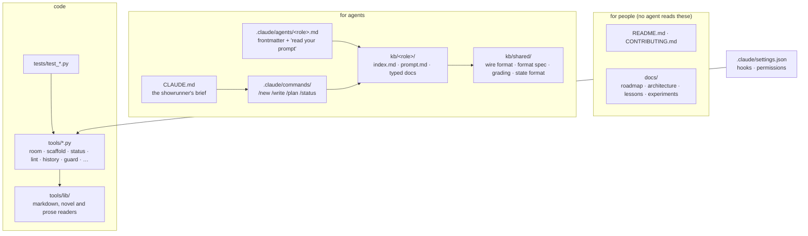
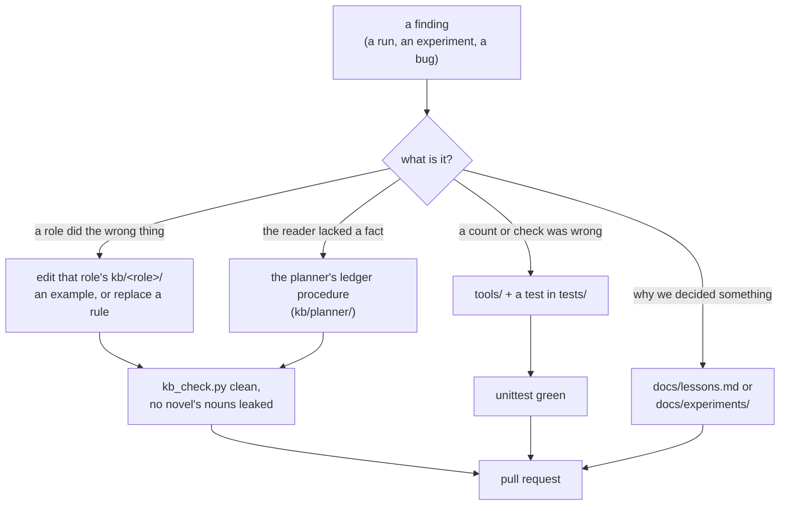

# Contributing

Thanks for looking. This repository is a toolkit: knowledge bases that agents read, thin agent
definitions, and Python tools that run the loop. It ships no novels. What the room does and why:
[README.md](README.md) and [docs/architecture.md](docs/architecture.md).

## Setup

### What you need

| what | version | why |
|---|---|---|
| [Claude Code](https://docs.claude.com/en/docs/claude-code) | recent (agent `effort` frontmatter, `StopFailure` hooks) | runs the room; the terminal CLI is preferred over an IDE panel, which injects its diagnostics into agents' contexts |
| a Claude plan with Opus and Sonnet | — | planner, writer, story editor and judge run on Opus; the rest on Sonnet |
| Python | 3.8+, as `python3` on `PATH` | the tools, the hooks and the status line call `python3` |
| git | any | |

No `pip install`: the tools use the standard library only. If a change needs a dependency, add it to
`requirements.txt` (create it) and say why in the pull request.

Optional: a checkout of [skilled-writer](https://github.com/Adhin37/skilled-writer) beside this one
(`../skilled-writer`). Some roadmap plans and experiment write-ups refer to it; nothing runs from it.

### Install

```sh
git clone git@github.com:Adhin37/ai-top-writer.git
cd ai-top-writer
python3 -m unittest discover tests     # all green before you start
claude                                 # open Claude Code here, in the repo root
```

Accept the folder-trust prompt: the project's hooks in [.claude/settings.json](.claude/settings.json)
(the path guard, session handoffs, the status line) only run in a trusted folder. Agents register
when a session starts, so a session opened in another directory cannot spawn the room.

Personal overrides go in `.claude/settings.local.json` or `CLAUDE.local.md`; both are gitignored.

### Try it

```text
/new A lighthouse keeper's daughter learns the light is what keeps the drowned from walking.
/write 2
/status
```

Your novel lands in `novels/<slug>/`, the reader's exports in `reading/<id>/`. Both are gitignored.
`python3 tools/clean.py` lists what each novel left outside `novels/`, and
`python3 tools/clean.py --delete <slug>` removes a novel with all of it.

## How the repo is put together



- **Agent files are thin.** `.claude/agents/<role>.md` holds the model, effort, tools and one line:
  read `kb/<role>/prompt.md`. The procedure lives in the knowledge base.
- **A prompt edit takes effect on the next spawn**; an edit to `.claude/agents/*.md` or
  `.claude/settings.json` may need a new session.
- **Knowledge bases use [OKF](docs/roadmap/03-knowledge-bases.md):** the role reads `index.md`
  first, then `prompt.md`, then a typed doc only when it applies. Optional modules are `toggle-*.md`
  docs, switched on in a novel's `novel.md`.
- **Isolation is a hook.** [tools/guard.py](tools/guard.py) decides what each role may read and
  write (`ROLES`); the table is in [docs/architecture.md](docs/architecture.md#isolation). A new path
  a role needs goes there, with a test in `tests/test_guard.py`.

## Where a change goes

Most contributions start from something a run got wrong: a chapter the beta reader found confusing,
a note the writer could not act on, a tool that miscounted. The rule that kept this repo out of its
predecessor's trouble: **a finding becomes an example, a ledger entry, or a rule that replaces one,
never a rule appended to a pile.**



### Knowledge bases (`kb/`)

- **Examples use invented nouns**, never a real novel's names. `python3 tools/kb_check.py --novel
  novels/<slug>` sweeps the bundles for one novel's proper nouns.
- **The writer gets intent and examples; critics get the rules.** Each rule has one owner. Before
  adding a rule, find the doc that already covers that ground and replace or sharpen what is there.
- **Craft docs follow one template:** the idea in three sentences, worked examples (the version that
  works beside a flat one), and when to break it. Critics' docs are catalogues: a pattern, and the
  note or finding it becomes.
- **No history in a knowledge base.** Why a rule exists goes in `docs/`; an agent reading the past
  is spending attention on it.
- **Keep the walls.** Working roles do not read each other's critics' rubrics, and nobody in the loop
  reads the judge's. Don't link across them.
- **No diagrams in `kb/` or `.claude/agents/`.** No person reads those files.

Run `python3 tools/kb_check.py` after any change: it checks the bundles' shape (frontmatter, every doc
linked from its index, every agent file pointing at a prompt that exists) and prints words and negations per doc, as information.

### Tools (`tools/`)

- **Standard library by default.** A dependency is fine when it earns its place; record it in
  `requirements.txt`.
- **A tool comes with a test file** in `tests/` (`tools/foo.py` → `tests/test_foo.py`).
  `tests/novel_fixture.py` builds a small novel in a temp directory; use it instead of a real one.
- **Tools report; judgement decides.** No tool gates on a number. A check prints findings; a role or
  the showrunner decides what they mean.
- **Output stays terse.** What one agent writes for another follows the wire format
  ([kb/shared/wire.md](kb/shared/wire.md)); `tools/wire.py` parses it, so a format change goes in
  both, with tests.

### Docs for people

`README.md` and `CONTRIBUTING.md` explain flows with diagrams: a fenced `mermaid` block, which
GitHub renders, instead of more prose.

## Checks before a pull request

```sh
python3 -m unittest discover tests          # must pass
python3 tools/kb_check.py                   # after any kb/ change: no shape findings
python3 tools/kb_check.py --novel novels/<slug>   # if you ran a novel: no leaked nouns
git status --ignored                        # nothing from novels/, reading/, bench/, docs/sessions/ staged
```

If your change alters what an agent does, say in the pull request how you checked it: a run of the
chapters it affects, or a cheap blind comparison with `tools/bench.py` (frozen rounds, two arms,
agreement). A prompt change nobody ran is a proposal; label it so.

## Test runs and experiments

A test run measures the room, so anything you do by hand is something the room did not have to do.
The full rules: [docs/test-run-protocol.md](docs/test-run-protocol.md). In short:

1. `touch .test-run` first. The guard then refuses the main session's writes under `novels/`.
2. Never repair a chapter by hand. If a role's output is wrong, fix its `kb/<role>/prompt.md` and run
   the role again.
3. Pass `--log docs/experiments/<date>-<name>.md` to every `tools/room.py` call so the hand-backs
   are kept verbatim.
4. Write the run up in `docs/experiments/` (what changed, what was measured, the verdict), name the
   novel in `bench/<experiment>/key.md`, and `rm .test-run` when it is written up.

`python3 tools/trace.py <session-id> --agents --chapters` gives a session's cost per role and per
chapter.

## Privacy

Everything a run produces is gitignored: `novels/*` (except `_template/` and the README),
`reading/`, `bench/`, `docs/sessions/` (session handoffs, which hold agent prompts and your
messages) and `.test-run`. Keep it that way. Before you commit an experiment write-up, check it holds
no absolute paths from your machine (`/home/...`, `/Users/...`) and only as much of a novel's text
as the finding needs.

## Commits and pull requests

- One topic per pull request. Roadmap work: one plan, or one fix to a plan.
- Commit messages: `feat: …`, `fix: …`, `docs: …`, `test: …`, short and in the imperative
  (`feat: plan 06c`, `fix: mermaid`).
- A pull request that changes the roadmap's state updates the *Features* table in
  [docs/roadmap/README.md](docs/roadmap/README.md): what is built, and whether a run showed it
  working.

By contributing you agree that your work is licensed under the project's
[Apache 2.0 license](LICENSE).
