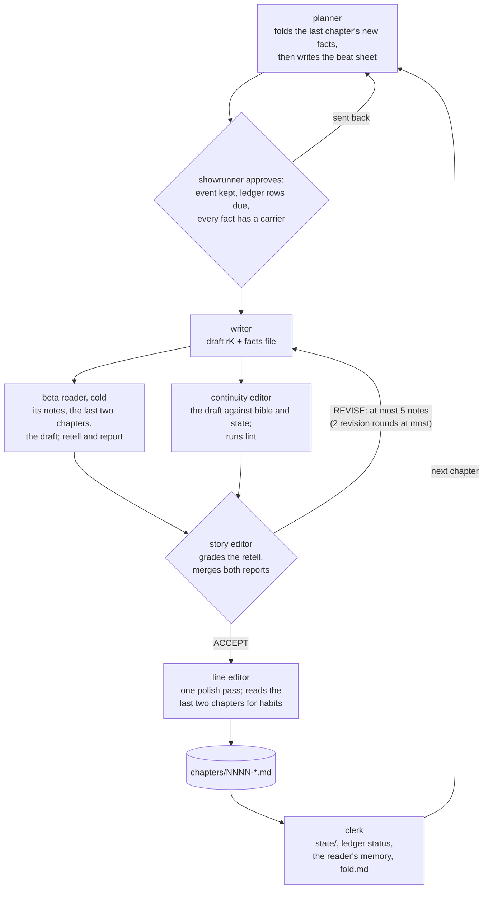

# ai-top-writer

A writers' room for serialized web fiction, run by Claude Code agents: a planner designs the story,
a writer drafts each chapter, a beta reader who has never seen the bible reads it cold, and editors
turn that reader's experience into specific notes the writer revises against.

It is the rebuild of [skilled-writer](../skilled-writer), whose sixth benchmark run shipped five
chapters with zero defects from every instrument and an opening chapter its user could not follow.
Why the rebuild, and what it keeps: [docs/roadmap/00-diagnosis.md](docs/roadmap/00-diagnosis.md).

## Status

Plans 01 (chapter 1), 01b (the wire format) and 02 (the full loop across chapters) have run. What
is built, and whether a run has shown it working: the *Features* table in
[docs/roadmap/README.md](docs/roadmap/README.md), which also says which plan is next.

To run a plan, open Claude Code **in this directory** (agents register when a session starts) and
say *"execute docs/roadmap/NN"*.

## One chapter through the room



Each round's beta reader is fresh, and only the accepted round's notes become the reader's memory.
Every role ends on one status line; what one role needs from another travels in files.

## Layout

```
.claude/agents/   thin agent definitions
kb/               one knowledge base per role (OKF: index.md + typed docs)
tools/            the loop's tools: exports and the reader's shelf, lint, state check, the path
                  guard, hand-backs, the wire-format checker, cost traces, session handoffs
tests/            python3 -m unittest discover tests
docs/             roadmap, architecture, novel format, lessons, experiments
novels/           the books (gitignored)
reading/, bench/  the reader's shelf and experiment arms (gitignored)
```

Requires Python 3.8+ and Claude Code. Standard library only.
