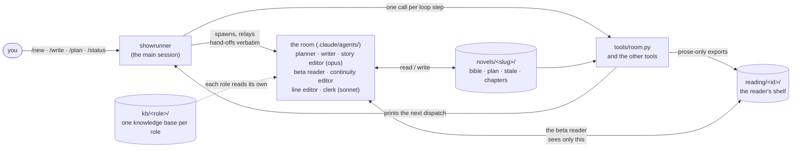
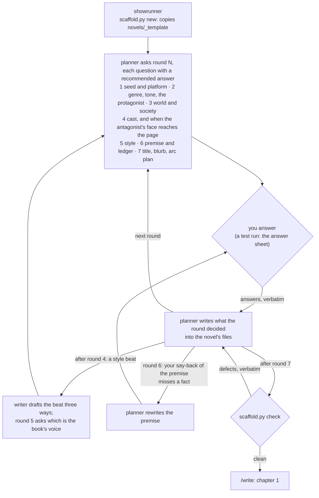
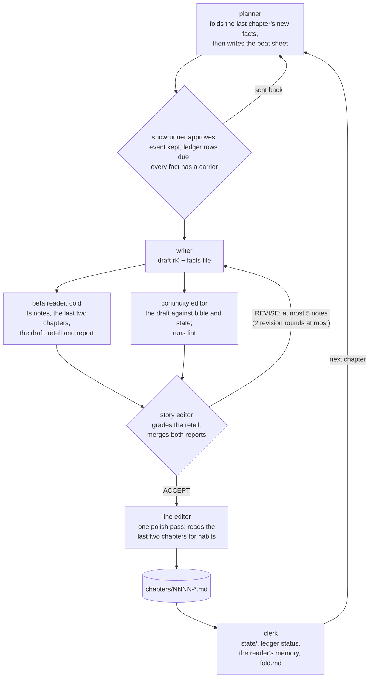
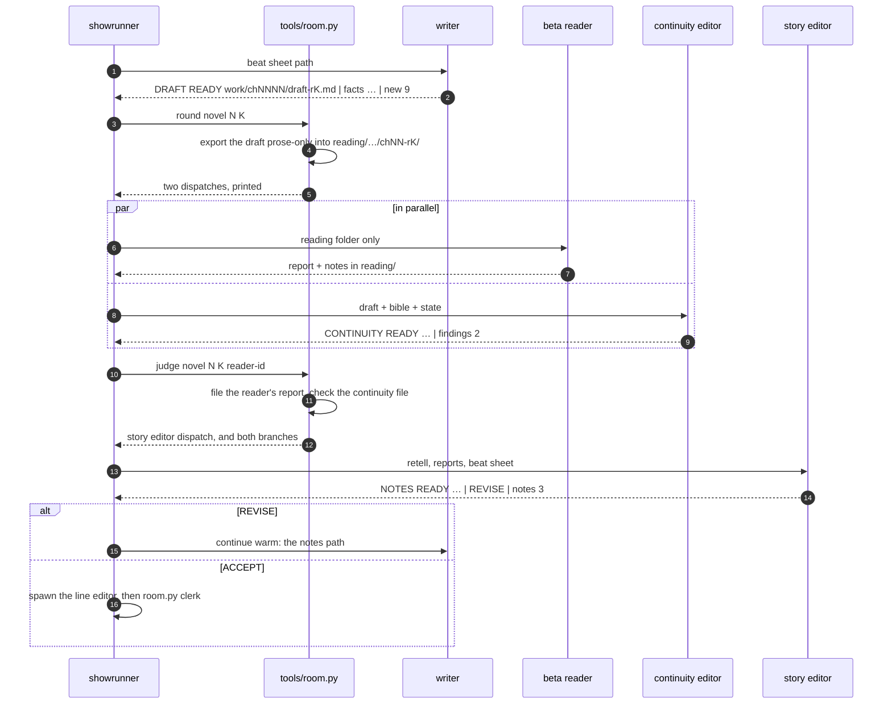
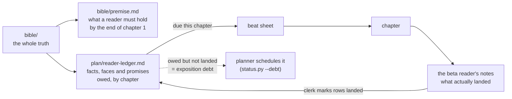
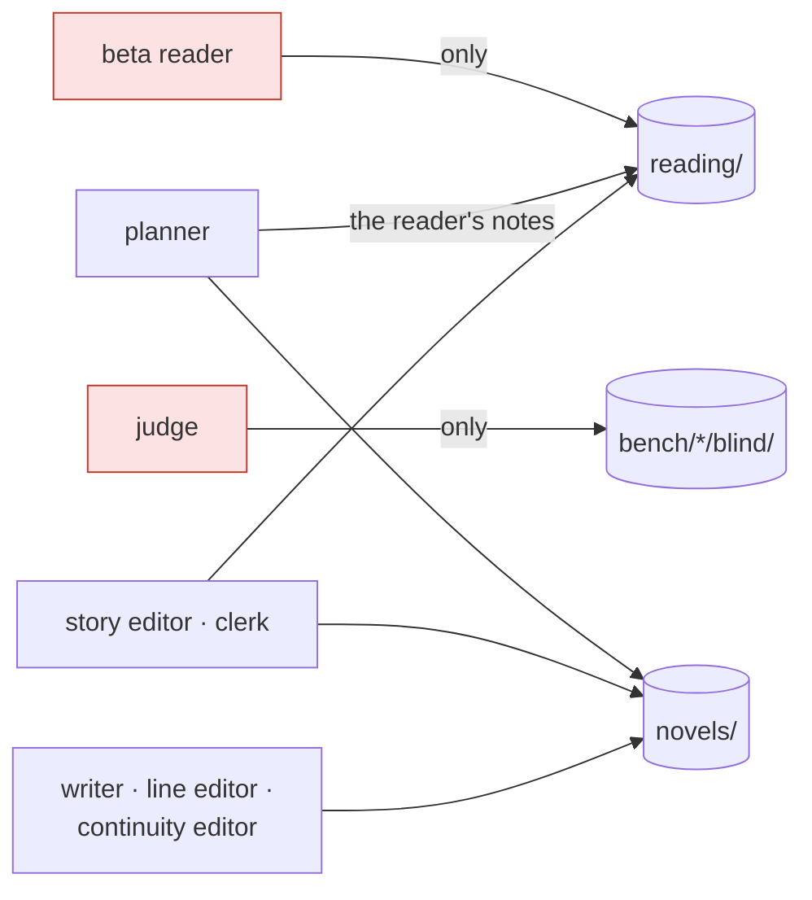

# ai-top-writer

A writers' room for serialized web fiction (Royal Road / webnovel.com style), run by Claude Code
agents: a planner designs the story, a writer drafts each chapter, a beta reader who has never seen
the bible reads it cold, and editors turn that reader's experience into specific notes the writer
revises against.

It is the rebuild of [skilled-writer](https://github.com/Adhin37/skilled-writer), whose sixth
benchmark run shipped five chapters with zero defects from every instrument and an opening chapter
its user could not follow. Why the rebuild, and what it keeps:
[docs/roadmap/00-diagnosis.md](docs/roadmap/00-diagnosis.md).

## The idea in one picture

You talk to one Claude Code session, the **showrunner**. It writes no prose: it runs a loop of
specialised agents, moves their files with Python tools, and relays what one agent hands back to
the next.



A ninth role, the **judge**, is not in the loop. It reads blind copies in `bench/` for benchmarks,
with a different questionnaire from the beta reader's, so the room cannot tune itself to its judge.

## Status

Rebuild in progress. Plans 01 to 06c have run: chapter 1, the wire format, the full loop across
chapters, the knowledge bases, setting up a new novel, benchmark run #7 (**4.5 / 5 from three blind
judges**, against 3.5 for skilled-writer's run #6), and the cost measurements. What is built, and
whether a run has shown it working: the *Features* table in
[docs/roadmap/README.md](docs/roadmap/README.md), which also says which plan is next.

## Using it

Install and setup: [CONTRIBUTING.md](CONTRIBUTING.md#setup). Then open Claude Code **in this
directory** (agents register when a session starts) and type one of four commands:

| command | what it does |
|---|---|
| `/new [the story in a few sentences]` | the planner interviews you in seven rounds, each question with an answer it recommends, and writes the bible, cast, premise, reader ledger and arc plan |
| `/write [n]` | the next chapter (or the next `n`) through the room |
| `/plan [a direction]` | more chapter rows and ledger rows, and what the ledger owes squared with what the plan delivers |
| `/status` | where the novel stands: chapters, what the page still owes, the reader's last click-next |

Your book lives in `novels/<slug>/`, which git ignores: the book is yours, not the repo's.

## Starting a novel: `/new`



## One chapter through the room: `/write`



Each round's beta reader is fresh, and only the accepted round's notes become the reader's memory.

### How a hand-off travels

Agents never pass prose through the showrunner's summary. Each role writes a file and ends on one
**status line** ([kb/shared/wire.md](kb/shared/wire.md)); `tools/room.py` parses it, does the
deterministic work (exports, copies, checks), and prints the exact dispatch for the next agent.



## What the reader knows is state

The bible holds the whole truth. The reader holds only what the page has said. The gap between
them is tracked in files, not guessed at.



Chapter 1 is **webnovel-clear**: by its end a reader can state the world's central rule, the
protagonist's situation and the stakes in plain words.

## Who may read what

A reader who knows the bible cannot notice what the page never says, and a writer who can read the
reader's questionnaire writes for the questionnaire. `tools/guard.py`, a `PreToolUse` hook, enforces
the walls (the source of truth is `ROLES` in that file). A missing arrow is a wall: the writer
never sees the reader's reports, and no role in the loop opens `bench/`, `docs/` or the judge's
knowledge base.



The beta reader and the judge have no `Bash` tool, which is their real wall; the full table is in
[docs/architecture.md](docs/architecture.md#isolation).

## Layout

```
.claude/agents/    thin agent definitions: frontmatter + "read kb/<role>/prompt.md"
.claude/commands/  /new, /write, /plan, /status
.claude/skills/    handoff: resume a session across a usage-limit reset
.claude/settings.json  permissions, the guard hook, session hooks, the status line
kb/                one knowledge base per role (OKF: index.md + prompt.md + typed docs); kb/shared/
tools/             the loop's tools: one call per loop step (room.py), the scaffold and its
                   check, status, exports and the reader's shelf, lint, history, state check,
                   the path guard, hand-backs, the wire-format checker, cost traces, benchmarks,
                   cleanup, session handoffs
tests/             python3 -m unittest discover tests
docs/              for people only (no agent reads it): roadmap, architecture, novel format,
                   lessons, experiments
novels/            the books (gitignored), and _template/, which /new copies
reading/, bench/   the reader's folders, one per novel, and experiment arms (gitignored;
                   tools/clean.py says which novel each belongs to)
```

Requires Python 3.8+ (standard library only) and Claude Code. Contributing:
[CONTRIBUTING.md](CONTRIBUTING.md).

## License

[LICENSE](LICENSE).
