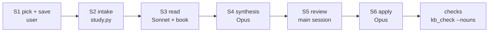

# Genre study

How to learn a genre from the books its readers reward: the top books of the genre on Royal Road
and Webnovel, chapters 1–10 of each, read by subagents and folded into `kb/`. `tools/study.py`
runs the steps; this file is the protocol, and the text the study's agents are sent to.

Unlike the rest of `docs/`, agents read this file: the study's readers and its synthesis agent are
not room roles. No room agent reads it.



Every step is read off the files: `python3 tools/study.py next research/<genre>` prints the step
and its dispatches, after a reset as before it. Run it only when no study agent is in flight.

## Selection

- **Royal Road:** *Best Rated*, filtered to the genre's tag. **Webnovel:** the genre's
  power ranking.
- **Picks:** the top 5 of each list, in rank order.
- **Skips:** pass over a book with fewer than 10 free chapters, and a book already picked from the
  other list. Take the next one instead, and log each skip and its reason in `progress.md`.
- Royal Road and Webnovel refuse automated fetches, and Royal Road's robots.txt shuts out AI
  crawlers. So the user saves the chapters from their own browser; nothing scrapes them.

## Saving (the user)

Save each book's chapters 1–10 into `research/<genre>/inbox/`, then fill its `books.md` row
(`src`: the path, relative to the study folder). Either way works:

- **one EPUB per book**, from the WebToEpub browser extension (it supports both sites; set the
  chapter range to 1–10). Intake skips the cover and information pages; if it guesses chapter 1
  wrong, set `first` in the row;
- **a folder of saved pages** (*Save page as… → Web page, HTML only*), one page per chapter, named
  so they sort in order (`01.html` … `10.html`).

`python3 tools/study.py intake research/<genre>` writes `source/<slug>/chNN.md`, prose only:
- it drops navigation, comments and the line Royal Road hides in every chapter;
- it marks author's notes `> [A/N]`;
- it prints words per chapter, and flags gaps and stubs (a locked chapter saves as a short teaser).

The source text is the authors'. It stays in `research/` (gitignored). No sentence of it goes into a tracked
file.

## Reader

You read one book's first ten chapters the way its audience does, one chapter at a time, and write
down what each chapter did to you. You are not reviewing the book. You are finding out what made a
reader click *next*, and what nearly stopped them.

**Procedure.**
1. If notes already exist in your notes folder, read them first, and start at the chapter your
   prompt names.
2. Read the next chapter in full, then write its notes file at once (`chNN.md`), before you open the
   next chapter. A stop must lose at most one chapter.
3. After the last chapter, write `summary.md` and `names.txt`.
4. End on the one line your prompt gives.

Read only your book's `source/` folder and your own notes. No web, no other book's notes, no `kb/`.

**Two readers in one.** Answer each question as two readers where they differ:
- **the fan**, who knows the source work well (use what you know of it);
- **the cold reader**, who has never met it.

The room's own beta reader is the cold one, so where they part is the study's most useful finding.

**`chNN.md`: one per chapter, these headings, short answers.** Point at the text by paragraph
(`¶12`), or with a quote of at most one sentence.

```
# chNN — <chapter title> (<words> words)

## Retell
Five lines at most: what happens, in order.

## Canon
What the chapter assumes the reader knows of the source; what it explains, and how (a scene, a
memory, a block of telling); where the story leaves canon (divergence, self-insert, transmigration,
reincarnation, an original character, a crossover, a system), and how plainly that is signalled.

## Fan / cold
Where the two readers part: what the fan gets that the cold reader misses, and whether the chapter
still works for the cold one.

## Opening and ending
The first lines: what they promise. The last lines: the hook, and its kind (a question, a threat, a
reveal, a decision, a cost, a cut mid-action, none).

## Exposition
Each passage that explains: where, how long, and whether it bit (was it needed at that moment?).

## Scene and summary
What is played in full, and what is told in summary. Was the event of the chapter on the page?

## People
Canon characters: in character or not, and whether the page shows why they changed. Original
characters: what they add. Who gets a voice of their own.

## Voice
Viewpoint, tense, narrator distance; the prose's habits, good and bad; any status screens or other
system or meta text, and how they read.

## Skim or drop
Each place a reader would skim or stop, with ¶ and why. "None" is an answer.

## Next
What makes the reader open the next chapter, in one or two lines. Would the fan? The cold reader?
```

**`summary.md`, after the last chapter.**
- **The book in three lines:** premise, type (self-insert, divergence, …), what it sells.
- **Strongest three techniques:** each with the chapters that show it, and why it works on a reader.
- **Weakest three:** each with chapters, and the cost to the reader.
- **The hook curve:** for each chapter, a word for the next-click pull (strong / fair / weak), and
  whether the fan and the cold reader differ.
- **What a writer in this genre should steal**, and **what they should avoid**, as plain lessons
  with no names from the book.

**`names.txt`.** Every proper noun of the book and its source work that you met: people, places,
groups, powers, coined terms. One per line. The leak sweep checks `kb/` against it.

## Synthesis

You turn ten readers' notes into findings, and propose where each one goes in the knowledge bases.

**Read:**
- `books.md` and `progress.md`;
- every `notes/<slug>/summary.md`, then the chapter notes as you need them;
- the knowledge-base docs a finding could land in, before you propose anything:
  - planner: `toggle-fanfic.md` (or the genre's toggle), `toggle-foreknowledge.md`, `toggle-litrpg.md`,
    `premise.md`, `arcs-and-chapters.md`, `title-and-blurb.md`, `cast-design.md`;
  - writer: `openings-and-endings.md`, `orienting-the-reader.md`, `scene-and-summary.md`,
    `distinct-voices.md`, and its `index.md`;
  - story editor: `promises.md`, `across-chapters.md`;
  - line editor: `ai-default-habits.md`;
  - beta reader: `prompt.md`;
  - the one-paragraph rules in `CLAUDE.md` (*The principles, short* and *Working on the toolkit
    itself*).

**Rules for a finding:**
- **Evidence:** it rests on two books or more, each cited by title and chapter. One book is an
  anecdote; say so if you keep it.
- **No source text:** you paraphrase. The study document is tracked, so it carries titles, chapter
  numbers and paraphrase only.
- **Good and bad:** say what failed as plainly as what worked. A top book's weakness the readers
  forgave is a finding too: say what bought the forgiveness.
- **Scope:** mark each finding `<genre>` (true of the genre) or `cross-genre` (true of web serials;
  it must not lean on anything genre-specific).
- **Fit the knowledge bases' rules:**
  - a finding becomes an example, a reader-ledger entry, or a rule that *replaces* a named rule;
  - never a rule appended to a pile;
  - each rule has one owner role;
  - the writer gets intent and examples, and the critics get the rules;
  - if a doc already says it, the finding is a confirmation, not a proposal.

**The document** (the path your prompt gives). Its sections:
1. **Question and method:** the lists, the picks and skips (from `progress.md`), and what was read.
2. **The books:** one paragraph each — premise, type, what it sells, its hook curve.
3. **Findings:** one subsection each. The claim; the evidence by book and chapter; where it fails or
   has exceptions; fan vs cold reader where it matters.
4. **The platforms:** what differs between the Royal Road and the Webnovel picks.
5. **Proposals:** one table, these columns, `verdict` left blank:

   | id | finding | scope | books | destination | kind | owner | verdict |
   |---|---|---|---|---|---|---|---|
   | F1 | … | fanfic | 4 (A ch1-3, B ch2, …) | kb/writer/toggle-fanfic.md (new) § … | example | writer | |

   - `kind`: `example`, `ledger entry`, `replaces: <the rule's first words>`, `new doc`, or
     `confirms` (no edit).
   - For a `new doc`, give its index row: when to open it, and the `novel.md` key that switches it
     on.
6. **Not proposed:** findings left out, and why.

## Review

The main session decides each proposal row. No user pick is needed. It writes `accept`, or
`reject — <reason>`, into the `verdict` cell, and logs the reasons in `progress.md`.

It rejects a row that:
- appends a rule without replacing one;
- gives a rule a second owner;
- cannot be made without quoting a book;
- rests on one book, unless it is a genre-only example;
- says what a doc already says.

## Apply

You edit the knowledge bases for the accepted rows only.

**Read first:**
- the study document;
- `docs/roadmap/03-knowledge-bases.md`, *the doc template*: the idea in a few sentences, then
  `## Examples`, with the working version beside the flat one;
- each doc you will touch.

**Rules:**
- **Invented nouns only:** never a studied book's names, its source work's, or the room's current
  novel's. `kb_check.py --nouns` sweeps for the studied ones.
- **No dates or study references in a doc:** an agent reading why a rule exists spends attention on
  the past. The evidence stays in the study document.
- **A replacement replaces:** delete the old rule's text; do not leave both.
- **A new doc** has OKF frontmatter: `type`, `title`, `description`, `roles`, and `toggle` when a
  `novel.md` key switches it on. Link it from its role's `index.md` with an *open it when* line
  (under *Optional modules* when it is a toggle).

**When done:**
1. Append `## Applied` to the study document: one line per row, giving the doc and section changed.
2. Run `python3 tools/kb_check.py`.
3. End on your line.
