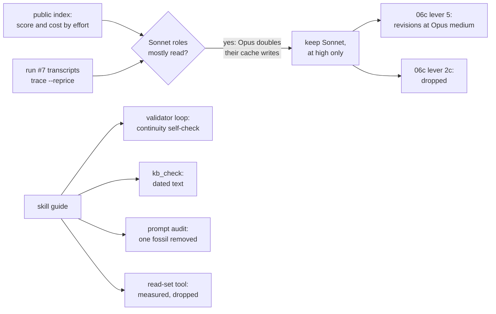

# 06d — Session 7d: model and effort by role, and the skill-authoring guide against `kb/`

**Goal:** answer two questions from the user with the evidence already on disk, spending no agent
runs. First, is Sonnet 5.5 worth its place, given that public benchmarks put it near Opus 5.5's cost?
Second, which concepts from Anthropic's
[skill-authoring best practices](https://platform.claude.com/docs/en/agents-and-tools/agent-skills/best-practices)
should `kb/` adopt? Evidence and decisions:
[2026-10-04-model-effort.md](../experiments/2026-10-04-model-effort.md).

This plan depends on 06c, whose open levers it re-aims.

## Steps

1. `tools/trace.py --reprice ROLE=MODEL`: a role's recorded tokens priced at another model's
   rates.
2. A decision per role, in the note. The rule: **Sonnet 5.5 runs at `high` only; a role that needs
   more moves to Opus at `medium`.** It goes in the roadmap's standing decisions and CLAUDE.md, and
   `kb_check` warns on a Sonnet agent at another effort.
3. Re-aim 06c: lever 5 becomes the writer's revisions at Opus `medium`, and lever 2c is dropped.
4. The guide: the continuity editor validates its own file; `kb_check` warns on time-sensitive
   text in `kb/`; a prompt audit (the `claude-api` skill's method) of every non-calibrated prompt.
5. A bible read-set tool for the continuity editor, measured before its prompt changes.

## Exit criteria

- Unit tests green; `kb_check` clean on the current novel.
- The next full run shows the continuity editor's final message as one line in every spawn, with
  `wire.py check` in its transcript, and its findings and cost a spawn beside run #7's.

## Session log

**2026-10-04.** No agent spawned.

- **Built:**
  - `trace.py --reprice`. Run #7's four Sonnet roles cost $11.90 with the unrecorded output
    allotted, and $22.13 at Opus rates with the same tokens. Their cache writes double, and no
    effort setting changes those. **No role changes model.**
  - `kb_check` warnings: `effort` (a Sonnet agent off `high`) and `dated` (a date, run, plan,
    session or lesson number in `kb/`). Both are clean on the repo.
  - The continuity editor now runs `wire.py check` on its file and fixes what it reports before
    its status line.
  - Tests for all three: `tests/test_trace.py`, `tests/test_kb_check.py`.
- **Measured and dropped:** `touches.py`. Over run #7's bible, the lines a draft's names touch
  came to 83–86% of its words. The note has the numbers.
- **Prompt audit:** the surface was close to clean.
  - Removed one fossil: the continuity editor's anti-recap sentence, a Sonnet 5 fix that Sonnet
    5.5 did not need in 18 spawns.
  - Rewrote CLAUDE.md principle 7, which pointed at plan 06 as future.
  - Flagged and kept: the clerk's copy of the same sentence (its evidence is confounded), plus
    four low-confidence lines. The note lists them.
- **Set aside:** inlining the always-read docs, tables of contents, gerund names, loop checklists.
  The note gives the reasons.
- **07 stays next.** The next full run checks this plan's changes along with 06b's checklist and
  06c's kept lever.
